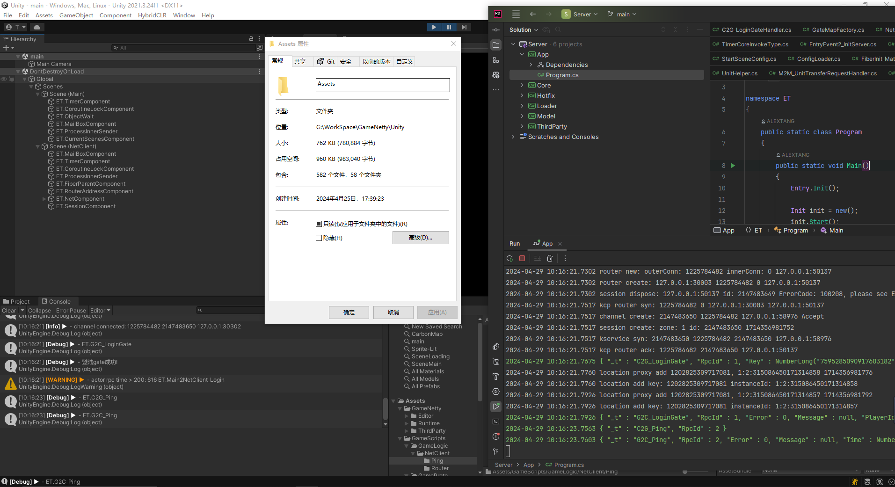

# GameNetty

众所周知，目前游戏开发中最好的C#服务器基本上就是ET框架的服务器。但无奈他是一个整体的解决方案、前后端共享的方式以及工程共享、前后端耦合的模式不是所有人都能接受。还有客户端工程为了共享以及ClientServer模式加入了很多不必要的代码和库（monogo和NLog等）很多人想用ET做网络需求。最方便接入只能往里面加自己的代码。于是再次首次拆分最新的ET8.1的前后端！客户端最精简大约750k，完美做成包的形式，几乎零成本 无侵入的嵌入进你的框架。真正做到人人都能往自己框架加ET。

<strong>改动：转表工具和启动服务器配置完全使用最新luban。现已完美兼容支持。</strong>

---
服务器运行指南：

1.打开Share解决方案编译Share.Analyzer And Share.SourceGenerator。Share.Tool此时无需编译（因为依赖Server，在第二步Server编译过后方可编译）。

2.打开Server服务器解决方案直接编译。（一定要执行第一步，因为Server依赖分析器和源代码生成器）。

3.完成、直接运行Server。

---
遵循开源MIT协议，原源码所有权@Copyright (c) 2018 tanghai

## <strong>特别鸣谢
#### <a href="https://github.com/egametang/ET"><strong>ET</strong></a> - ET是一个开源的游戏客户端（基于unity3d）服务端双端框架，服务端是使用C# .net core开发的分布式游戏服务端，其特点是开发效率高，性能强，双端共享逻辑代码，客户端服务端热更机制完善。

## <strong>Buy me a 奶茶.

[如果觉得本仓库对您有帮助，不妨请我可爱的女儿买杯奶茶吧~](Books/Donate.md)